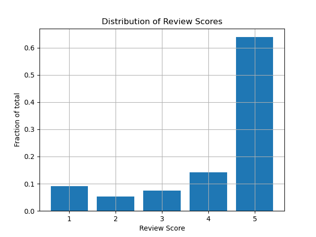

## Background

Repository to do NLP tasks, namely the following:

- Sentiment Analysis
- Entity Extraction
- Text Summarization

## Dataset

We'll use the following publicly available dataset, from [Amazon food reviews](https://www.kaggle.com/datasets/snap/amazon-fine-food-reviews/data).

The data dictionary is as follows:

| Column Name            | Description                                                               | Data Type |
| ---------------------- | ------------------------------------------------------------------------- | --------- |
| Id                     | Row ID                                                                    | int64     |
| ProductId              | Unique identifier for Product                                             | object    |
| UserId                 | Unique identifier for User                                                | object    |
| ProfileName            | Profile name of the user                                                  | object    |
| HelpfulnessNumerator   | Number of users who found the review helpful                              | int64     |
| HelpfulnessDenominator | Number of users who indicated wether they found the review helpful or not | int64     |
| Score                  | Rating between 1 and 5                                                    | int64     |
| Time                   | Timestamp for the review                                                  | int64     |
| Summary                | Brief summary of the review                                               | object    |
| Text                   | Full review                                                               | object    |

## EDA

Follow the notebook located on the [jupyter_notebooks](https://github.com/bcrodrigo/nlp_reviews/tree/main/jupyter_notebooks) directory. The main finding is with regards to the class balances of the review Score:

As seen in the graph above, the score of 5 is by far the most popular, compared to the other scores.

## Modelling

### Sentiment Analysis

In this section I want to try different approaches to perform a sentiment analysis on the reviews:

- Bag of words model with Count Vectorizer
- TFID
- LSTM
- Other pre-trained models

As noted in the EDA, there is a class imbalance, so we'll have to address it by:
1. Mapping the score from 1-5 to 0-2 (bad, neutral, good)
2. Downsampling the category with the highest review

### NLP Tasks

We'll use the [spaCy](https://spacy.io/) library to perform NLP tasks, such as tokenization, lemmatization, etc.